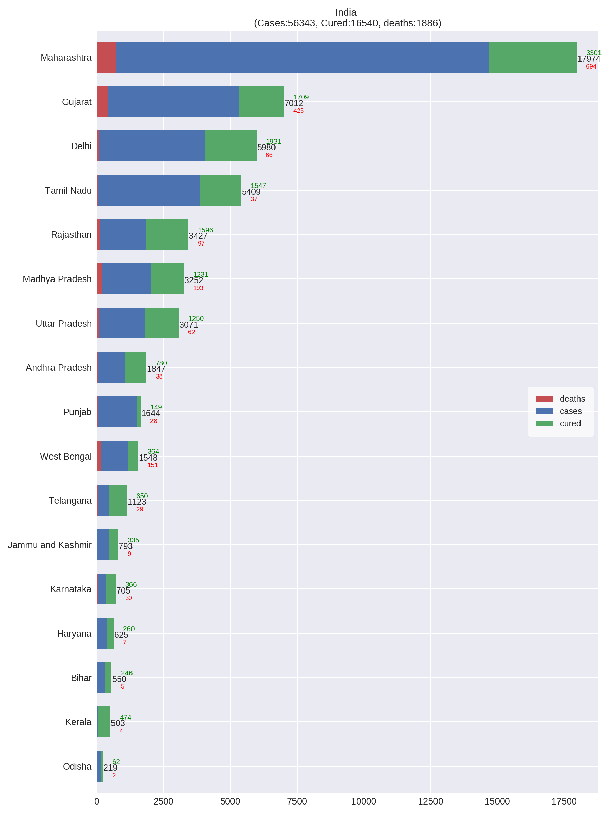

# Covid-19 Statewise data for India

### Credits : [Data Source https://github.com/datameet/covid19](https://github.com/datameet/covid19)
### [jishnupdas](https://github.com/jishnupdas/Covid-19-IND)
---

# This repo provides a simple visualisation for Covid-19 information for each of the indian states

*This data is sourced mainly from Govt and news agencies. The information presented here is publicly avialable*

---

Each state's data is visualized in three different plots

- The standard 'time vs cases' cases starting from March
- The same time vs cases in a logarithmic scale
- Number of cases reported per day in each state

# Summary 

